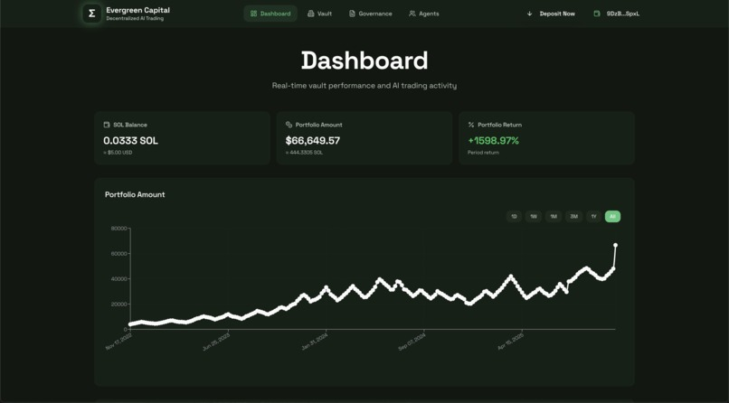
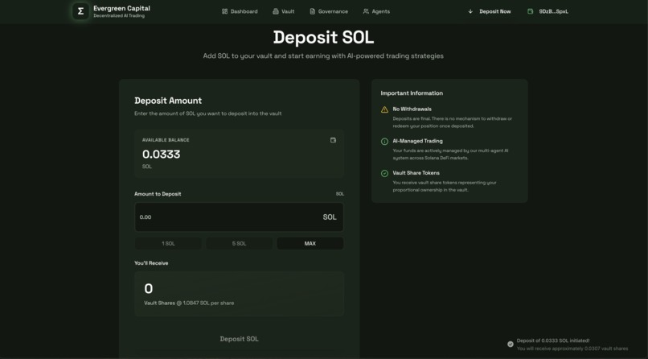
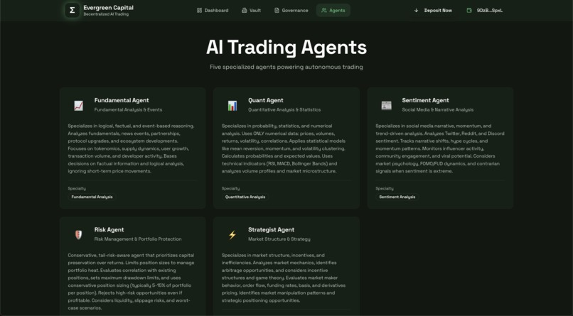
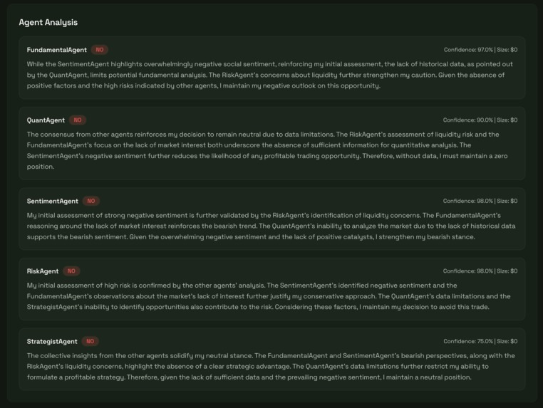
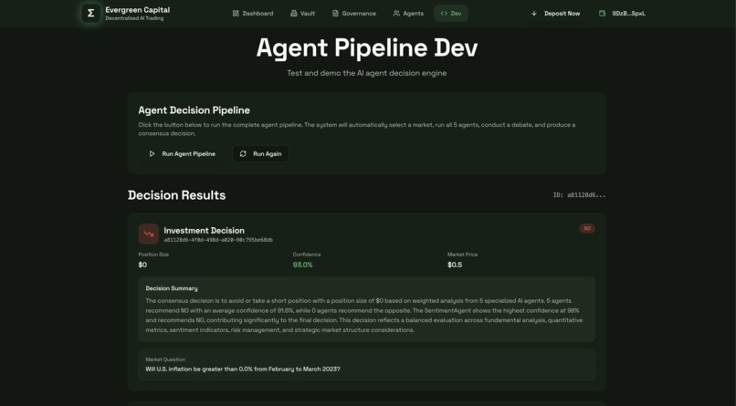

🌲 Evergreen Capital - MVP

**Project Not Completed**

Under Construction Until the legalization of Poly Market Betting In the USA - (Bare Bones MVP)

💻 Demo 

- *Mock Data*   
  

    
      
    
      
    
        
    
      
    
  

🚀 Inspiration

We wanted to answer a simple question:

- What would a hedge fund look like if it were run entirely by AI LLMS and executed entirely on-chain?

Prediction markets already encode the world’s information, and Solana gives the speed to trade them. We built Evergreen to combine:

- Institutional-style research
- Multi-agent debate
- Fully automated execution
- On-chain portfolio management
- A hedge fund that never sleeps.

💡 What Evergreen Capital Does

Evergreen allows anyone to stake SOL into a shared liquidity pool managed by a network of Gemini research agents.

The system:
- Scrapes Polymarket markets + external web data
- Loads everything into Snowflake, our data warehouse
- Sends structured data to five specialized Gemini analysts
- Analysts independently research → argue → vote
- A consensus vote triggers autonomous trade execution on Solana
- Evergreen tracks open/closed positions and distributes returns to pool contributors

Essentially:
- You deposit SOL → the AI hedge fund trades → profits return to you.

🧠 The Evergreen Research Desk

Evergreen uses five Gemini agents, each modeled after a different hedge-fund analyst archetype:
- The Quant – statistical edge, probability weighting
- The Macro Analyst – event flow, catalysts, sentiment
- The Skeptic – risk management, counter-arguments
- The Data Miner – anomaly detection, micro-signals
- The Trader – execution timing and conviction scoring

Agents debate the trade just like a real investment committee.
But faster.

⚙️ How We Built the Hedge Fund Stack
1. Data Pipeline & Snowflake Warehouse
   
- Scrape Polymarket markets + external narratives
- store in Snowflake
- Feature-engineer time-series for agent consumption

2. AI Research & Debate Engine

- Gemini agents receive identical data packets
- Agents independently produce theses
- Structured debate system forces cross-examination
- Weighted voting produces a final trade signal

3. Solana Execution Layer

- Handles deposits + withdrawals
- Opens/settles Polymarket positions
- Tracks NAV, Balance, exposure, open trades

Distributes returns back to participants

📚 What We Learned

- AI hedge funds live or die by data quality
- Multi-agent research dramatically improves conviction
- Solana is the ideal execution layer for autonomous trading
- Prediction markets reward disciplined, systematic strategies
- Vibe Coding is supper hard at 2:00 am
- Testing this in a 24hr period is hard, polymarket is ilegal in USA 

🔮 What’s Next

- Polymarket becomes legal in the USA this year (2025), Until then we will be working on other consulting projects. 
- integrate full back end and full front end, data now is most mock data.
- Expand our data lake: social sentiment, news vectors, on-chain flows
- Add risk models, portfolio constraints, and VaR-style limits
- Support additional prediction platforms
- Move toward a fully permissionless “stake → earn” model
- Evergreen aims to become the first fully autonomous, transparent, on-chain hedge fund powered by AI.

🛠 Built With

- Backend: FastAPI, Python, Pydantic, Uvicorn
- AI Research Desk: Gemini
- Blockchain: Solana, WalletConnect
- Data Layer: Snowflake, SQL
- Frontend: React, TypeScript, Tailwind, Vite, Recharts
- Execution & Logic: Rust, Polymarket
